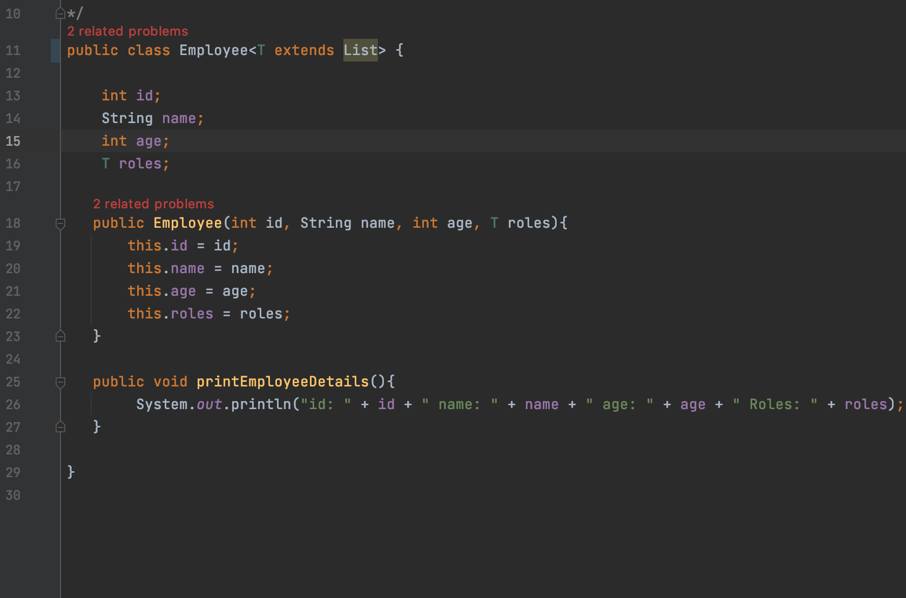

# tutorial-code-java-generics
java generics example

---

* Created by Akash Tyagi on 7th-Feb-2020
---

#### Simple Generic Class Example:

* Steps to Follow:

* Created a Class with "Paramatarized" Type
* Because, lets just say we are not sure what is type of the roles can be.
* Role property could be simple string like "admin", or it could be an array of roles. example: [manager, admin]
* Since we do not know so we decided to keep it "generic"
* So that when user of this class creates the object, he can decide whether he want to send a String as role or Arrays of multiple role.
* Check the main.example.TestGenericsMainClass on how to create the Object for this.
* This is how you made main.example.Employee class more flexible to take different types of data types.
* Notice, we have three examples below:
* Sending the Role as String, and the class is accepting it.
* Sending the Role as ArrayList and HashMap and in both the cases Class is accepting it.
* Only thing is that while creating the main.example.Employee Object you have to define the value of type "T".

* main.example.Employee Class with T as generic Type
```java

/*
1. Created a Class with "Paramatarized" Type
2. Because, lets just say we are not sure what is type of the roles can be.
3. Role property could be simple string like "admin", or it could be an array of roles. example: [manager, admin]
4. Since we do not know so we decided to keep it "generic"
5. So that when user of this class creates the object, he can decide whether he want to send a String as role or Arrays of multiple role.
6. Check the main.example.TestGenericsMainClass on how to create the Object for this.
*/
public class main.example.Employee<T> {

    int id;
    String name;
    int age;
    T roles;

   public main.example.Employee(int id, String name, int age, T roles){
       this.id = id;
       this.name = name;
       this.age = age;
       this.roles = roles;
   }

   public void printEmployeeDetails(){
        System.out.println("id: " + id + " name: " + name + " age: " + age + " Roles: " + roles);
   }

}

```

* Init Generic Class Example Code:

```java
import main.example.Employee;

import java.util.ArrayList;
import java.util.HashMap;

/*
This is how you made main.example.Employee class more flexible to take different types of data types.
Notice, we have three examples below:
1. Sending the Role as String, and the class is accepting it.
2. Sending the Role as ArrayList and HashMap and in both the cases Class is accepting it.
3. Only thing is that while creating the main.example.Employee Object you have to define the value of type "T".
 */
public class main.example.TestGenericsMainClass {

    public static void main(String[] args) {

        //1. Create main.example.Employee object with only single role
        Employee<String> empWithSingleRole = new Employee<String>(1, "Akash", 36, "Admin");
        empWithSingleRole.printEmployeeDetails();

        //2. Create a employee with multiple roles stored in array
        ArrayList<String> listRoles = new ArrayList<String>();
        listRoles.add("Admin");
        listRoles.add("Manager");
        listRoles.add("HR");
        Employee<ArrayList<String>> employeeWithMultipleRoleArrayList = new Employee<ArrayList<String>>(2, "Timothy", 29, listRoles);
        employeeWithMultipleRoleArrayList.printEmployeeDetails();

        //3. Create a employee with multiple roles stored in Hash Map
        HashMap<String, String> hmRoles = new HashMap<String, String>();
        hmRoles.put("Admin", "Desc: CRUD ops");
        hmRoles.put("Manager", "Desc: Management of Teams");
        hmRoles.put("HR", "Desc: HR Ops");
        Employee<HashMap<String, String>> employeeWithMultipleRoleHashMap = new Employee<HashMap<String, String>>(3, "SunShun", 25, hmRoles);
        employeeWithMultipleRoleHashMap.printEmployeeDetails();
    }
}

/*
Output of Above Program:
id: 1 name: Akash age: 36 Roles: Admin
id: 2 name: Timothy age: 29 Roles: [Admin, Manager, HR]
id: 3 name: SunShun age: 25 Roles: {HR=Desc: HR Ops, Admin=Desc: CRUD ops, Manager=Desc: Management of Teams}
 */

```

### How to Limit the Type of Values which can be passed to the class

* There can be cases where you wish to send parameter to the main.example.Employee Class but you want to limit to the specific type only.
* For example, I want to user to send only "List" type of Data structure and not String, or Hash Map.
* To do this, I will have to make use of "extends" keyword. This will restrict the user of this class from passing anything other than List type.

* See the use of extends Key word in the Generic bracket at line 11:

> 

* Check there is a compile time error thrown at line 17 and 33 when we are trying to pass HashMap or String.
* Since, we have written in the main.example.Employee Class that we will only accept anything which belongs to Interface List.
* This qualifies, ArrayList and LinkedList and in both the cases there is no error as depicted in the below screen shot. Check line: 25 and 41.


> 